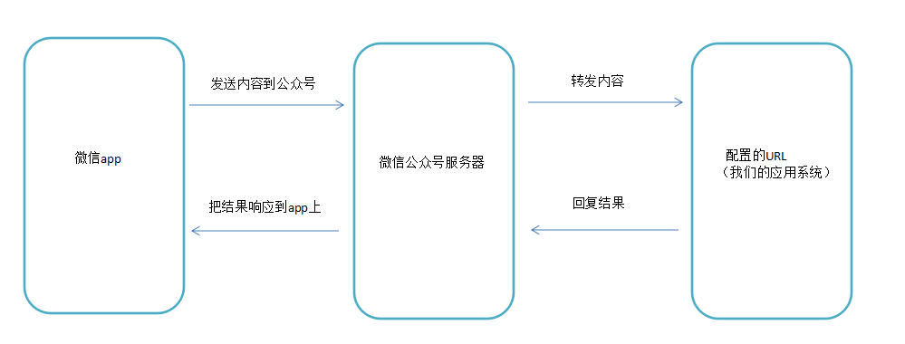

# 03-微信开发 -1-简介

## 一 微信的一些平台

### 1.1 公众号的分类

微信公众号分为四类：

- 订阅号：每天能推送消息，允许个人申请，适合资讯服务（如各种媒体）
- 服务号：每月 4 次推送，适合企业数据服务交互（如招商银行公众号）
- 企业号：现在叫做企业微信，企业内部办公管理使用（可以理解为叮叮）
- 小程序：小程序功能更多，但是无法像微信号那样主动发送消息给用户。

### 1.2 申请称为微信开发者

在微信公众后台（<https://mp.weixin.qq.com>）可以申请成为开发者，或者直接使用微信测试号：<http://mp.weixin.qq.com/debug/cgi-bin/sandbox?t=sandbox/login>。现在由于公众号的接口都需要企业资质，所以只有测试号才适合开发使用。

配置中的 IP 白名单作用：只有配置了白名单的 IP 才能调取微信接口（相当于增强了安全性，防止因为开发者 ID 和密码被盗后，被盗取者调用接口）

微信开发必须使用外网地址，所以需要配置自己的服务器地址，当然也可以使用 ngork，配置内网穿透地址（百度即可）。

### 1.3 微信公众平台

开发平台：在开发平台可以查看各类文档，下载开发工具，地址如下：

<https://developers.weixin.qq.com/miniprogram/dev/api/>

微信公众平台：专门用来管理微信公众号相关的后台。
微信公众平台地址：<http://mp.weixin.qq.com>

微信公众平台分为两种管理模式：

- 编辑模式：进入公众平台后，左侧默认提供的管理功能，已经提供了大多数功能。
- 开发模式：进入开发模式后，公众号编辑模式下的功能全部作废，需要开发人员手动开发相应功能，能够让公众号拥有更强大的功能。

## 二 微信公众号的交互

### 2.1 微信与服务器交互过程

当我们在微信 app 上，给公众号发送一条内容的时候，实际会发送到微信的服务器上，由微信服务器封装后再转发到我们配置好的服务器 URL 上：



### 2.2 内网穿透

由于微信服务器需要向我们的服务器 URL 发送消息，所以我们自己的服务器的 URL 必须是暴露给外界访问的一个公网地址，不能使用内网地址，生产环境可以申请腾讯云，阿里云服务器等，开发环境中可以暂时利用一些软件来完成内网穿透，便于修改和测试，如 ngrok（<https://dashboard.ngrok.com>）。

使用 ngork 的命令可以映射本地端口为外网地址：

```txt
ngrok http 3000
```

### 2.3 验证 URL 有效性

在测试账号页面设置服务器 URL 后，微信会测试该 URL 的有效性，即微信会发送 GET 请求给服务器，该 GET 请求携带四个参数：

```txt
signature：微信加密签名，使用开发者填写的 token、timestamp、nonce 参数形成
timestamp：时间戳
nonce：随机数
echostr：随机字符串
```

服务端接收到 GET 请求后，通过 signature 字段进行校验，若确认该次 GET 请求来自微信服务器，则鸳鸯返回 echostr 参数内容，即验证成功。验证过程：

```txt
1、使用 token、timestamp、nonce 三个参数进行字典序排序。注意 token 是我们自己填写的。
2、将三个参数字符串拼接成一个字符串进行 sha1 加密
3、加密字符串与 signature 对比，一致则表示请求来源于微信服务器
```

URL 校验步骤示例图：


贴士：校验成功后微信仍然会发送上述几个参数，所以无论如何都要进行校验，只是首次校验是 GET 方法。

书写这个校验是否是微信服务器的工具方法：

```js
const sha1 = require('sha1')

class Wechat {
  // 校验是否是微信服务器：参数为微信上设置的 token
  static checkWxServer(option, token) {
    // option 参数为组装的微信服务器参数对象：timestamp,nonce,signature
    // 1 字典排序
    const arr = [option.timestamp, option.nonce, token].sort()
    // 2 计算字符串
    let wxSha1 = sha1(arr.join(''))
    // 3 对比是否是微信服务器消息
    return wxSha1 === option.signature
  }
}

module.exports = Wechat
```

在服务端使用该工具方法进行验证：

```js
const Wechat = require('./utils/wx') // 导入上述微信工具类

const wxConfig = {
  token: 'xxxxx', // 书写的 token
  appID: 'xxxxxxx',
  appSecret: 'xxxxxxxx',
}

app.use(async (ctx, next) => {
  // 0 获取微信发送过来的参数
  const { signature, echostr, timestamp, nonce } = ctx.query
  const { token } = wxConfig

  let isWxServer = Wechat.checkWxServer(
    {
      signature: signature,
      echostr: echostr,
      timestamp: timestamp,
      nonce: nonce,
    },
    token
  )

  // 是微信服务器发送的消息
  if (isWxServer) {
    let method = ctx.method
    // 首次校验
    if (method === 'GET') {
      ctx.body = '验证成功'
    }
    if (method === 'POST') {
      // 提取内容
    }
    await next()
  }

  await next()
})
```
