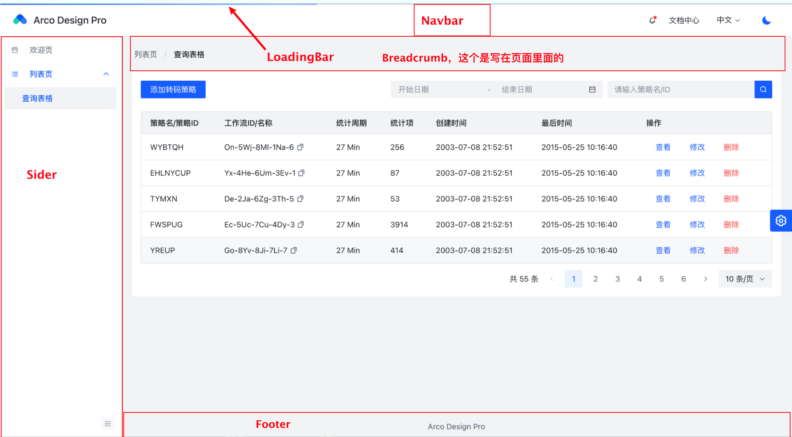

# 第37节：布局预览及代码简单剖析

## 1.[布局](https://arco.design/docs/pro/layout)

[布局](https://arco.design/docs/pro/layout)

目前提供的布局只有一套，应用到了所有路由页面上，包含`侧边菜单栏`，`顶部通知栏`，`页脚`和`内容区域`，其中`侧边栏和顶部通知栏都是 fixed 的`，方便用户在滚动的过程中关注到其他视图。

[Layout组件](https://arco.design/docs/spec/layout)

## 2.对比[ant design pro](https://preview.pro.ant.design/dashboard/workplace/?navTheme=light&colorWeak=true&title=Ant+Design+Pro&fixSiderbar=true&layout=mix#83ac36)

[ant design pro](https://preview.pro.ant.design/dashboard/workplace/?navTheme=light&colorWeak=true&title=Ant+Design+Pro&fixSiderbar=true&layout=mix#83ac36)

## 3.布局代码剖析

布局代码路径：`admin/src/layout/page-layout.tsx`



### LoadingBar

`admin/src/components/LoadingBar/index.tsx`

```tsx
import React, { useRef, useState, forwardRef, useImperativeHandle } from 'react';
import { Progress } from '@arco-design/web-react';

function LoadingBar(_, ref) {
  const loadingTimer = useRef(null);

  const [percent, setPercent] = useState<number>(30);
  const [hide, setHide] = useState<boolean>(true);

  function loading() {
    setHide(false);
    setPercent(30);
    loadingTimer.current = setInterval(() => {
      if (percent <= 98) {
        setPercent(percent > 80 ? percent + 1 : percent + 10);
      }
    }, 1000);
  }

  function success() {
    clearInterval(loadingTimer.current);
    setPercent(100);

    setTimeout(() => {
      setHide(true);
    }, 300);
  }

  useImperativeHandle(ref, () => ({
    loading,
    success,
  }));

  return !hide ? (
    <Progress
      percent={percent}
      showText={false}
      animation
      style={{ position: 'absolute', height: 2, top: -1, zIndex: 9999 }}
    />
  ) : null;
}

export default forwardRef(LoadingBar);

```

- 这个组件其实就是很简单，一个[Progress](https://arco.design/react/components/progress)进度条组件，接收一个`percent`参数。
- 通过一个定时器开启对`percent`的设置，从30开始到80，每一秒钟`+10`，当到了80且小于98则每一秒钟`+1`。

- 通过`forwardRef`和`useImperativeHandle`向父组件提供2个方法：`loading` `success`。

- 父组件可以直接通过`ref`来调用这2个方法。

### NavBar

```tsx
import React from 'react';
import {
  Tooltip,
  Button,
  Avatar,
  Select,
  Typography,
  Dropdown,
  Menu,
  Space,
} from '@arco-design/web-react';
import { IconSunFill, IconMoonFill } from '@arco-design/web-react/icon';
import { useSelector, useDispatch } from 'react-redux';
import { ReducerState } from '../../redux';
import useLocale from '../../utils/useLocale';
import Logo from '../../assets/logo.svg';
import history from '../../history';

import MessageBox from '../MessageBox';

import styles from './style/index.module.less';

function Navbar() {
  const locale = useLocale();
  const theme = useSelector((state: ReducerState) => state.global.theme);
  const userInfo = useSelector((state: ReducerState) => state.global.userInfo);
  const dispatch = useDispatch();

  function logout() {
    localStorage.setItem('userStatus', 'logout');
    history.push('/user/login');
  }

  function onMenuItemClick(key) {
    if (key === 'logout') {
      logout();
    }
  }

  return (
    <div className={styles.navbar}>
      <div className={styles.left}>
        <Space size={8}>
          <Logo />
          <Typography.Title style={{ margin: 0, fontSize: 18 }} heading={5}>
            博客后台管理系统
          </Typography.Title>
        </Space>
      </div>
      <ul className={styles.right}>
        <li>
          <MessageBox />
        </li>
        <li>
          <a>{locale['navbar.docs']}</a>
        </li>
        <li>
          <Select
            options={[
              { label: '中文', value: 'zh-CN' },
              { label: 'English', value: 'en-US' },
            ]}
            value={localStorage.getItem('arco-lang')}
            bordered={false}
            triggerProps={{
              autoAlignPopupWidth: false,
              autoAlignPopupMinWidth: true,
              position: 'bl',
            }}
            onChange={(value) => {
              localStorage.setItem('arco-lang', value);
              window.location.reload();
            }}
          />
        </li>
        <li>
          <Tooltip
            content={
              theme === 'light'
                ? locale['settings.navbar.theme.toDark']
                : locale['settings.navbar.theme.toLight']
            }
          >
            <Button
              type="text"
              icon={theme === 'light' ? <IconMoonFill /> : <IconSunFill />}
              onClick={() =>
                dispatch({
                  type: 'toggle-theme',
                  payload: { theme: theme === 'light' ? 'dark' : 'light' },
                })
              }
              style={{ fontSize: 20 }}
            />
          </Tooltip>
        </li>
        {userInfo && (
          <li>
            <Avatar size={24} style={{ marginRight: 8 }}>
              
            </Avatar>
            <Dropdown
              trigger="click"
              droplist={
                <>
                  <Menu onClickMenuItem={onMenuItemClick}>
                    <Menu.Item key="publish">发布文章</Menu.Item>
                  </Menu>
                  <Menu onClickMenuItem={onMenuItemClick}>
                    <Menu.Item key="logout">退出登出</Menu.Item>
                  </Menu>
                </>
              }
            >
              <Typography.Text className={styles.username}>{userInfo.name}</Typography.Text>
            </Dropdown>
          </li>
        )}
      </ul>
    </div>
  );
}

export default Navbar;

```

- 这个组件我们依次从左到右来看

- 首先是一个logo组件

    ```tsx
    <Logo />
    ```

- 然后是我们的title

    ```tsx
    <Typography.Title style={{ margin: 0, fontSize: 18 }} heading={5}>
      博客后台管理系统
    </Typography.Title>
    ```

- 后边的`MessageBox`以及`<a>{locale['navbar.docs']}</a>`我们是不需要的。注释掉。

- 剩下的就是`语言切换`,这里默认2种语言，需要其他的可以自己添加。

    ```tsx
    <li>
      <Select
        options={[
          { label: '中文', value: 'zh-CN' },
          { label: 'English', value: 'en-US' },
        ]}
        value={localStorage.getItem('arco-lang')}
        bordered={false}
        triggerProps={{
          autoAlignPopupWidth: false,
            autoAlignPopupMinWidth: true,
              position: 'bl',
        }}
        onChange={(value) => {
          localStorage.setItem('arco-lang', value);
          window.location.reload();
        }}
        />
    </li>
    ```

- 主题切换 `dark`和`light`

    ```tsx
    <li>
      <Tooltip
        content={
          theme === 'light'
            ? locale['settings.navbar.theme.toDark']
          : locale['settings.navbar.theme.toLight']
        }
        >
        <Button
          type="text"
          icon={theme === 'light' ? <IconMoonFill /> : <IconSunFill />}
          onClick={() =>
      dispatch({
        type: 'toggle-theme',
        payload: { theme: theme === 'light' ? 'dark' : 'light' },
      })
                  }
          style={{ fontSize: 20 }}
          />
      </Tooltip>
    </li>
    ```

- 最后一个就是用户信息的了。那么这里默认没有展示出来是因为，用户信息没有设置到我们的redux状态管理里面

    ```tsx
    {userInfo && (
      <li>
        <Avatar size={24} style={{ marginRight: 8 }}>
          
        </Avatar>
        <Dropdown
          trigger="click"
          droplist={
            <>
            <Menu onClickMenuItem={onMenuItemClick}>
              <Menu.Item key="publish">发布文章</Menu.Item>
            </Menu>
            <Menu onClickMenuItem={onMenuItemClick}>
              <Menu.Item key="logout">退出登出</Menu.Item>
            </Menu>
            </>
          }
          >
          <Typography.Text className={styles.username}>{userInfo.name}</Typography.Text>
        </Dropdown>
      </li>
    )}
    ```

    可以看到有个`userInfo`,我们看到他来自哪儿呢？来自`state.global.userInfo`

    ```tsx
     const userInfo = useSelector((state: ReducerState) => state.global.userInfo);
    ```

    这个时候我们去`admin/src/redux/global.ts`先手动添加一个用户信息。

    ```tsx
    const initialState: GlobalState = {
      theme: defaultTheme,
      settings: defaultSettings,
      userInfo:{
        name:'never',
        avatar:'http://www.nevergiveupt.top:3000/static/mine.d0f112df.jpeg'
      }
    };
    ```

    至此我们的`NavBar`组件就剖析完了

    

### Sider

这个组件主要是跟我们的菜单以及路由绑定的，我们下节在来剖析它。

### Footer

`admin/src/components/Footer/index.tsx`

```tsx
import React from 'react';
import { Layout } from '@arco-design/web-react';
import { FooterProps } from '@arco-design/web-react/es/Layout/interface';
import cs from '../../utils/classnames';
import styles from './style/index.module.less';

const Footer = Layout.Footer;

export default (props: FooterProps = {}) => {
  const { className, ...restProps } = props;
  return (
    <Footer className={cs(styles.footer, className)} {...restProps}>
      博客后台管理系统
    </Footer>
  );
};

```

这个Footer组件就很简单了。


http://nevergiveupt.top:3000/static/mine.d0f112df.jpeg


