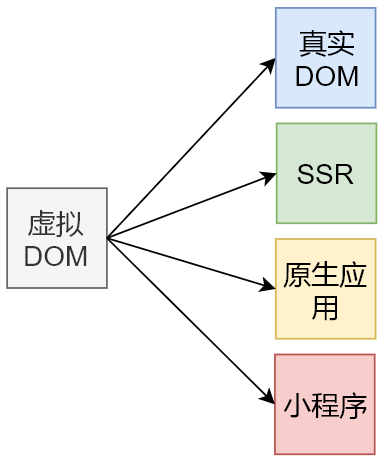
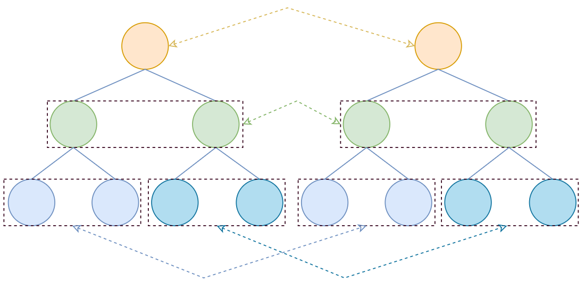
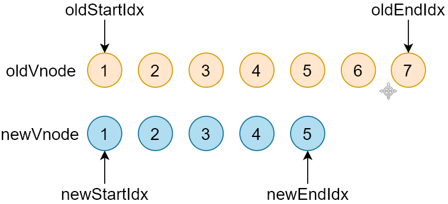
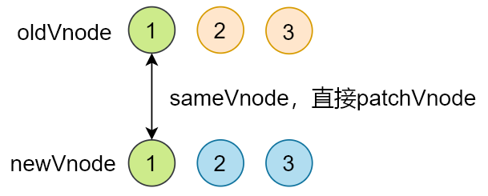
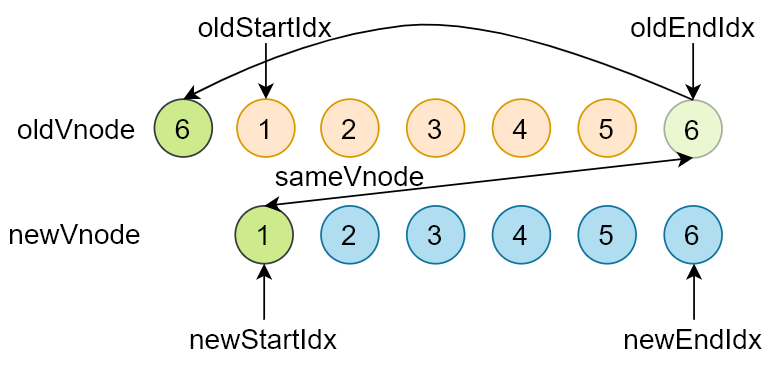
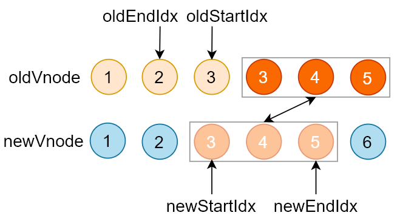
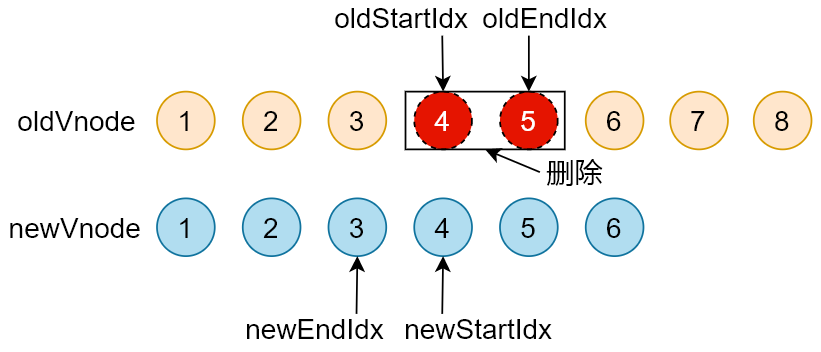
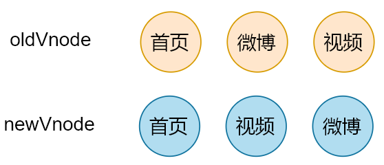

# Virtual DOM

## 课程目标

- 了解什么是虚拟 DOM，以及虚拟 DOM 的作用
- Snabbdom 的基本使用
- **Snabbdom 的源码解析**

## 什么是 Virtual DOM

- **Virtual DOM(虚拟 DOM)**，是由普通的 JS 对象来描述 DOM 对象，因为不是真实的 DOM 对象，所以叫 Virtual DOM

- 真实 DOM 成员

  ```js
  let element = document.querySelector('#app')
  let s = ''
  for (var key in element) {
    s += key + ','
  }
  console.log(s)
  // 打印结果
  align,title,lang,translate,dir,hidden,accessKey,draggable,spellcheck,autocapitalize,contentEditable,isContentEditable,inputMode,offsetParent,offsetTop,offsetLeft,offsetWidth,offsetHeight,style,innerText,outerText,oncopy,oncut,onpaste,onabort,onblur,oncancel,oncanplay,oncanplaythrough,onchange,onclick,onclose,oncontextmenu,oncuechange,ondblclick,ondrag,ondragend,ondragenter,ondragleave,ondragover,ondragstart,ondrop,ondurationchange,onemptied,onended,onerror,onfocus,oninput,oninvalid,onkeydown,onkeypress,onkeyup,onload,onloadeddata,onloadedmetadata,onloadstart,onmousedown,onmouseenter,onmouseleave,onmousemove,onmouseout,onmouseover,onmouseup,onmousewheel,onpause,onplay,onplaying,onprogress,onratechange,onreset,onresize,onscroll,onseeked,onseeking,onselect,onstalled,onsubmit,onsuspend,ontimeupdate,ontoggle,onvolumechange,onwaiting,onwheel,onauxclick,ongotpointercapture,onlostpointercapture,onpointerdown,onpointermove,onpointerup,onpointercancel,onpointerover,onpointerout,onpointerenter,onpointerleave,onselectstart,onselectionchange,onanimationend,onanimationiteration,onanimationstart,ontransitionend,dataset,nonce,autofocus,tabIndex,click,focus,blur,enterKeyHint,onformdata,onpointerrawupdate,attachInternals,namespaceURI,prefix,localName,tagName,id,className,classList,slot,part,attributes,shadowRoot,assignedSlot,innerHTML,outerHTML,scrollTop,scrollLeft,scrollWidth,scrollHeight,clientTop,clientLeft,clientWidth,clientHeight,attributeStyleMap,onbeforecopy,onbeforecut,onbeforepaste,onsearch,elementTiming,previousElementSibling,nextElementSibling,children,firstElementChild,lastElementChild,childElementCount,onfullscreenchange,onfullscreenerror,onwebkitfullscreenchange,onwebkitfullscreenerror,setPointerCapture,releasePointerCapture,hasPointerCapture,hasAttributes,getAttributeNames,getAttribute,getAttributeNS,setAttribute,setAttributeNS,removeAttribute,removeAttributeNS,hasAttribute,hasAttributeNS,toggleAttribute,getAttributeNode,getAttributeNodeNS,setAttributeNode,setAttributeNodeNS,removeAttributeNode,closest,matches,webkitMatchesSelector,attachShadow,getElementsByTagName,getElementsByTagNameNS,getElementsByClassName,insertAdjacentElement,insertAdjacentText,insertAdjacentHTML,requestPointerLock,getClientRects,getBoundingClientRect,scrollIntoView,scroll,scrollTo,scrollBy,scrollIntoViewIfNeeded,animate,computedStyleMap,before,after,replaceWith,remove,prepend,append,querySelector,querySelectorAll,requestFullscreen,webkitRequestFullScreen,webkitRequestFullscreen,createShadowRoot,getDestinationInsertionPoints,ELEMENT_NODE,ATTRIBUTE_NODE,TEXT_NODE,CDATA_SECTION_NODE,ENTITY_REFERENCE_NODE,ENTITY_NODE,PROCESSING_INSTRUCTION_NODE,COMMENT_NODE,DOCUMENT_NODE,DOCUMENT_TYPE_NODE,DOCUMENT_FRAGMENT_NODE,NOTATION_NODE,DOCUMENT_POSITION_DISCONNECTED,DOCUMENT_POSITION_PRECEDING,DOCUMENT_POSITION_FOLLOWING,DOCUMENT_POSITION_CONTAINS,DOCUMENT_POSITION_CONTAINED_BY,DOCUMENT_POSITION_IMPLEMENTATION_SPECIFIC,nodeType,nodeName,baseURI,isConnected,ownerDocument,parentNode,parentElement,childNodes,firstChild,lastChild,previousSibling,nextSibling,nodeValue,textContent,hasChildNodes,getRootNode,normalize,cloneNode,isEqualNode,isSameNode,compareDocumentPosition,contains,lookupPrefix,lookupNamespaceURI,isDefaultNamespace,insertBefore,appendChild,replaceChild,removeChild,addEventListener,removeEventListener,dispatchEvent
  ```

- 可以使用 Virtual DOM 来描述真实 DOM，示例

  ```js
  {
    sel: "div",
    data: {},
    children: undefined,
    text: "Hello Virtual DOM",
    elm: undefined,
    key: undefined
  }
  ```

## 为什么使用 Virtual DOM

- 手动操作 DOM 比较麻烦，还需要考虑浏览器兼容性问题，虽然有 jQuery 等库简化 DOM 操作，但是随着项目的复杂 DOM 操作复杂提升
- 为了简化 DOM 的复杂操作于是出现了各种 MVVM 框架，MVVM 框架解决了视图和状态的同步问题
- 为了简化视图的操作我们可以使用模板引擎，但是模板引擎没有解决跟踪状态变化的问题，于是 Virtual DOM 出现了
-  Virtual DOM 的好处是当状态改变时不需要立即更新 DOM，只需要创建一个虚拟树来描述 DOM， Virtual DOM 内部将弄清楚如何有效(diff)的更新 DOM

- 参考 github 上 [virtual-dom](https://github.com/Matt-Esch/virtual-dom) 的描述
  - 虚拟 DOM 可以维护程序的状态，跟踪上一次的状态
  - 通过比较前后两次状态的差异更新真实 DOM

## 虚拟 DOM 的作用

- 维护视图和状态的关系

- 复杂视图情况下提升渲染性能

- 除了渲染 DOM 以外，还可以实现 SSR(Nuxt.js/Next.js)、原生应用(Weex/React Native)、小程序(mpvue/uni-app)等

   

##  Virtual DOM 库

- [Snabbdom](https://github.com/snabbdom/snabbdom)
  - Vue 2.x 内部使用的 Virtual DOM 就是改造的 Snabbdom
  - 大约 200 SLOC（single line of code）
  - 通过模块可扩展
  - 源码使用 TypeScript 开发
  - 最快的 Virtual DOM 之一
- [virtual-dom](https://github.com/Matt-Esch/virtual-dom)

## 案例演示

- [jQuery-demo](https://codesandbox.io/s/jq-demo-5i7qp)
- [snabbdom-demo](https://codesandbox.io/s/snabbdom-demo-4hbyb)

# Snabbdom 基本使用成

## 创建项目

- 打包工具为了方便使用 [parcel](https://parceljs.org/getting_started.html)

- 创建项目，并安装 [parcel](https://parceljs.org/getting_started.html)

  ```bash
  # 创建项目目录
  md snabbdom-demo
  # 进入项目目录
  cd snabbdom-demo
  # 创建 package.json
  npm init -y
  # 本地安装 parcel
  npm install parcel-bundler -D
  ```

- 配置 package.json 的 scripts

  ```json
  "scripts": {
    "dev": "parcel index.html --open",
    "build": "parcel build index.html"
  }
  ```

- 创建目录结构

  ```txt
  │  index.html
  │  package.json
  └─src
       		01-basicusage.js
  ```

## 导入 Snabbdom

## Snabbdom 文档

- 看文档的意义
  - 学习任何一个库都要先看文档
  - 通过文档了解库的作用
  - 看文档中提供的示例，自己快速实现一个 demo
  - 通过文档查看 API 的使用
  
- 文档地址
  - https://github.com/snabbdom/snabbdom
  - 当前版本 v2.1.0
  
  ```bash
  # --depth 表示克隆深度, 1 表示只克隆最新的版本. 因为如果项目迭代的版本很多, 克隆会很慢
  git clone -b v2.1.0 --depth=1 https://github.com/snabbdom/snabbdom.git
  ```

### 安装  Snabbdom 

- 安装 Snabbdom

  ```bash
  npm install snabbdom@2.1.0
  ```

### 导入  Snabbdom 

- Snabbdom 的两个核心函数 init 和 h() 
  - init() 是一个高阶函数，返回 patch() 
  - h() 返回虚拟节点 VNode，这个函数我们在使用 Vue.js 的时候见过

```js
import { init } from 'snabbdom/init'
import { h } from 'snabbdom/h'
const patch = init([])
```

> 注意：此时运行的话会告诉我们找不到 init / h 模块，因为模块路径并不是 snabbdom/int，这个路径是在 package.json 中的 exports 字段设置的，而我们使用的打包工具不支持 exports 这个字段，webpack 4 也不支持，webpack 5 支持该字段。该字段在导入 snabbdom/init 的时候会补全路径成 snabbdom/build/package/init.js

```
"exports": {
    "./init": "./build/package/init.js",
    "./h": "./build/package/h.js",
    "./helpers/attachto": "./build/package/helpers/attachto.js",
    "./hooks": "./build/package/hooks.js",
    "./htmldomapi": "./build/package/htmldomapi.js",
    "./is": "./build/package/is.js",
    "./jsx": "./build/package/jsx.js",
    "./modules/attributes": "./build/package/modules/attributes.js",
    "./modules/class": "./build/package/modules/class.js",
    "./modules/dataset": "./build/package/modules/dataset.js",
    "./modules/eventlisteners": "./build/package/modules/eventlisteners.js",
    "./modules/hero": "./build/package/modules/hero.js",
    "./modules/module": "./build/package/modules/module.js",
    "./modules/props": "./build/package/modules/props.js",
    "./modules/style": "./build/package/modules/style.js",
    "./thunk": "./build/package/thunk.js",
    "./tovnode": "./build/package/tovnode.js",
    "./vnode": "./build/package/vnode.js"
  }
```

- 如果使用不支持 package.json 的 exports 字段的打包工具，我们应该把模块的路径写全
  - 查看安装的 snabbdom 的目录结构

```js
import { h } from 'snabbdom/build/package/h'
import { init } from 'snabbdom/build/package/init'
import { classModule } from 'snabbdom/build/package/modules/class'
```


- 回顾 Vue 中的 render 函数

```js
new Vue({
  router,
  store,
  render: h => h(App)
}).$mount('#app')
```

- thunk() 是一种优化策略，可以在处理不可变数据时使用

## 代码演示


### 基本使用

```js
import { h } from 'snabbdom/build/package/h'
import { init } from 'snabbdom/build/package/init'

// 使用 init() 函数创建 patch()
// init() 的参数是数组，将来可以传入模块，处理属性/样式/事件等
let patch = init([])

// 使用 h() 函数创建 vnode
let vnode = h('div.cls', [
  h('h1', 'Hello Snabbdom'),
  h('p', '这是段落')
])

const app = document.querySelector('#app')
// 把 vnode 渲染到空的 DOM 元素（替换）
// 会返回新的 vnode
let oldVnode = patch(app, vnode)

setTimeout(() => {
  vnode = h('div.cls', [
    h('h1', 'Hello World'),
    h('p', '这是段落')
  ])
  // 把老的视图更新到新的状态
  oldVnode = patch(oldVnode, vnode)
  // h('!') 是创建注释
  patch(oldVnode, h('!'))
}, 2000)
```

## 模块

Snabbdom 的核心库并不能处理 DOM 元素的属性/样式/事件等，如果需要处理的话，可以使用模块

### 常用模块

- 官方提供了 6 个模块

  - attributes
    - 设置 DOM 元素的属性，使用 `setAttribute`()
    - 处理布尔类型的属性
  - props
    - 和 `attributes` 模块相似，设置 DOM 元素的属性 `element[attr] = value`
    - 不处理布尔类型的属性
  - class
    - 切换类样式
    - 注意：给元素设置类样式是通过 `sel` 选择器
  - dataset
    - 设置 `data-*` 的自定义属性
  - eventlisteners
    - 注册和移除事件
  - style
    - 设置行内样式，支持动画
    - delayed/remove/destroy

### 模块使用

- 模块使用步骤：
  - 导入需要的模块
  - init() 中注册模块
  - 使用 h() 函数创建 VNode 的时候，可以把第二个参数设置为对象，其他参数往后移

### 代码演示

```js
import { h } from 'snabbdom/build/package/h'
import { init } from 'snabbdom/build/package/init'
// 导入需要的模块
import { styleModule } from 'snabbdom/build/package/modules/style'
import { eventListenersModule } from 'snabbdom/build/package/modules/eventlisteners'

// 使用 init() 函数创建 patch()
// init() 的参数是数组，将来可以传入模块，处理属性/样式/事件等
let patch = init([
  // 注册模块
  styleModule,
  eventListenersModule
])

// 使用 h() 函数创建 vnode
let vnode = h('div.cls', {
  // 设置 DOM 元素的行内样式
  style: { color: '#DEDEDE', backgroundColor: '#181A1B' },
  // 注册事件
  on: { click: clickHandler }
}, [
  h('h1', 'Hello Snabbdom'),
  h('p', '这是段落')
])

function clickHandler () {
  // 此处的 this 指向对应的 vnode
  console.log(this.elm.innerHTML)
}
```

# Snabbdom 源码解析

## 概述

### 如何学习源码

- 先宏观了解
- 带着目标看源码
- 看源码的过程要不求甚解
- 调试
- 参考资料

### Snabbdom 的核心

- 使用 h() 函数创建 JavaScript 对象(VNode)描述真实 DOM
- init() 设置模块，创建 patch()
- patch() 比较新旧两个 VNode
- 把变化的内容更新到真实 DOM 树上

### Snabbdom 源码

- 源码地址：

  - https://github.com/snabbdom/snabbdom

- src 目录结构

  ```
  ├── package
  │   ├── helpers
  │   │   └── attachto.ts		定义了 vnode.ts 中 AttachData 的数据结构
  │   ├── modules
  │   │   ├── attributes.ts
  │   │   ├── class.ts
  │   │   ├── dataset.ts
  │   │   ├── eventlisteners.ts
  │   │   ├── hero.ts				example 中使用到的自定义钩子
  │   │   ├── module.ts			定义了模块中用到的钩子函数
  │   │   ├── props.ts
  │   │   └── style.ts
  │   ├── h.ts							h() 函数，用来创建 VNode
  │   ├── hooks.ts					所有钩子函数的定义
  │   ├── htmldomapi.ts			对 DOM API 的包装
  │   ├── init.ts						加载 modules、DOMAPI，返回 patch 函数
  │   ├── is.ts							判断数组和原始值的函数
  │   ├── jsx-global.ts			jsx 的类型声明文件
  │   ├── jsx.ts						处理 jsx
  │   ├── thunk.ts					优化处理，对复杂视图不可变值得优化
  │   ├── tovnode.ts				DOM 转换成 VNode
  │   ├── ts-transform-js-extension.cjs
  │   ├── tsconfig.json			ts 的编译配置文件
  │   └── vnode.ts					虚拟节点定义
  ```

## h 函数

- h() 函数介绍

  - 在使用 Vue 的时候见过 h() 函数

    ```js
    new Vue({
      router,
      store,
      render: h => h(App)
    }).$mount('#app')
    ```

  - h() 函数最早见于 [hyperscript](https://github.com/hyperhype/hyperscript)，使用 JavaScript 创建超文本

  - Snabbdom 中的 h() 函数不是用来创建超文本，而是创建 VNode

- 函数重载

  - 概念

    - **参数个数**或**类型**不同的函数
    - JavaScript 中没有重载的概念
    - TypeScript 中有重载，不过重载的实现还是通过代码调整参数

  - 重载的示意

    ```js
    function add (a: number, b: number) {
      console.log(a + b)
    }
    function add (a: number, b: number, c: number) {
      console.log(a + b + c)
    }
    add(1, 2)
    add(1, 2, 3)
    ```
    
    ```js
    function add (a: number, b: number) {
      console.log(a + b)
    }
    function add (a: number, b: string) {
      console.log(a + b)
    }
    add(1, 2)
    add(1, '2')
    ```
    
    

- 源码位置：src/package/h.ts

  ```js
  // h 函数的重载
  export function h (sel: string): VNode
  export function h (sel: string, data: VNodeData | null): VNode
  export function h (sel: string, children: VNodeChildren): VNode
  export function h (sel: string, data: VNodeData | null, children: VNodeChildren): VNode
  export function h (sel: any, b?: any, c?: any): VNode {
    var data: VNodeData = {}
    var children: any
    var text: any
    var i: number
    // 处理参数，实现重载的机制
    if (c !== undefined) {
      // 处理三个参数的情况
      // sel、data、children/text
      if (b !== null) {
        data = b
      }
      if (is.array(c)) {
        children = c
      } else if (is.primitive(c)) {
        text = c
      } else if (c && c.sel) {
        children = [c]
      }
    } else if (b !== undefined && b !== null) {
      if (is.array(b)) {
        children = b
      } else if (is.primitive(b)) {
        // 如果 c 是字符串或者数字
        text = b
      } else if (b && b.sel) {
        // 如果 b 是 VNode
        children = [b]
      } else { data = b }
    }
    if (children !== undefined) {
      // 处理 children 中的原始值(string/number)
      for (i = 0; i < children.length; ++i) {
        // 如果 child 是 string/number，创建文本节点
        if (is.primitive(children[i])) children[i] = vnode(undefined, undefined, undefined, children[i], undefined)
      }
    }
    if (
      sel[0] === 's' && sel[1] === 'v' && sel[2] === 'g' &&
      (sel.length === 3 || sel[3] === '.' || sel[3] === '#')
    ) {
      // 如果是 svg，添加命名空间
      addNS(data, children, sel)
    }
    // 返回 VNode
    return vnode(sel, data, children, text, undefined)
  };
  ```

## VNode

- 一个 VNode 就是一个虚拟节点用来描述一个 DOM 元素，如果这个 VNode 有 children 就是 Virtual DOM 

- 源码位置：src/package/vnode.ts


```js
export interface VNode {
  // 选择器
  sel: string | undefined;
  // 节点数据：属性/样式/事件等
  data: VNodeData | undefined;
  // 子节点，和 text 只能互斥
  children: Array<VNode | string> | undefined;
  // 记录 vnode 对应的真实 DOM
  elm: Node | undefined;
  // 节点中的内容，和 children 只能互斥
  text: string | undefined;
  // 优化用
  key: Key | undefined;
}

export function vnode (sel: string | undefined,
                      data: any | undefined,
                      children: Array<VNode | string> | undefined,
                      text: string | undefined,
                      elm: Element | Text | undefined): VNode {
  const key = data === undefined ? undefined : data.key
  return { sel, data, children, text, elm, key }
}
```


## snabbdom

- patch(oldVnode, newVnode)
- 打补丁，把新节点中变化的内容渲染到真实 DOM，最后返回新节点作为下一次处理的旧节点
- 对比新旧 VNode 是否相同节点(节点的 key 和 sel 相同)
- 如果不是相同节点，删除之前的内容，重新渲染
- 如果是相同节点，再判断新的 VNode 是否有 text，如果有并且和 oldVnode 的 text 不同，直接更新文本内容
- 如果新的 VNode 有 children，判断子节点是否有变化，判断子节点的过程使用的就是 diff 算法
- diff 过程只进行同层级比较




### init

- **功能：**init(modules, domApi)，返回 patch() 函数（高阶函数）

- 为什么要使用高阶函数？

  - 因为 patch() 函数再外部会调用多次，每次调用依赖一些参数，比如：modules/domApi/cbs
  - 通过高阶函数让 init() 内部形成闭包，返回的 patch() 可以访问到 modules/domApi/cbs，而不需要重新创建

- init() 在返回 patch() 之前，首先收集了所有模块中的钩子函数存储到 cbs 对象中

- 源码位置：src/package/init.ts

  ```js
  const hooks: Array<keyof Module> = ['create', 'update', 'remove', 'destroy', 'pre', 'post']
  export function init (modules: Array<Partial<Module>>, domApi?: DOMAPI) {
    let i: number
    let j: number
    const cbs: ModuleHooks = {
      create: [],
      update: [],
      remove: [],
      destroy: [],
      pre: [],
      post: []
    }
    // 初始化 api
    const api: DOMAPI = domApi !== undefined ? domApi : htmlDomApi
    // 把传入的所有模块的钩子方法，统一存储到 cbs 对象中
    // 最终构建的 cbs 对象的形式 cbs = [ create: [fn1, fn2], update: [], ... ]
  	for (i = 0; i < hooks.length; ++i) {
      // cbs['create'] = []
      cbs[hooks[i]] = []
      for (j = 0; j < modules.length; ++j) {
        // const hook = modules[0]['create']
        const hook = modules[j][hooks[i]]
        if (hook !== undefined) {
          (cbs[hooks[i]] as any[]).push(hook)
        }
      }
    }
    ……
    return function patch (oldVnode: VNode | Element, vnode: VNode): VNode {
      ……
    }
  }
  ```

### patch

- **功能：**

  - 传入新旧 VNode，对比差异，把差异渲染到 DOM
  - 返回新的 VNode，作为下一次 patch() 的 oldVnode

- **执行过程：**

  - 首先执行**模块**中的**钩子**函数 `pre`
  - 如果 oldVnode 和 vnode 相同（key 和 sel 相同）
    - 调用 patchVnode()，找节点的差异并更新 DOM
  - 如果 oldVnode 是 DOM 元素
    - 把 DOM 元素转换成 oldVnode
    - 调用 createElm() 把 vnode 转换为真实 DOM，记录到 vnode.elm
    - 把刚创建的 DOM 元素插入到 parent 中
    - 移除老节点
    - 触发**用户**设置的 `create ` **钩子**函数
  
- 源码位置：src/package/init.ts

  ```js
  return function patch (oldVnode: VNode | Element, vnode: VNode): VNode {
    let i: number, elm: Node, parent: Node
    // 保存新插入节点的队列，为了触发钩子函数
    const insertedVnodeQueue: VNodeQueue = []
    // 执行模块的 pre 钩子函数
    for (i = 0; i < cbs.pre.length; ++i) cbs.pre[i]()
  	// 如果 oldVnode 不是 VNode，创建 VNode 并设置 elm 
    if (!isVnode(oldVnode)) {
      // 把 DOM 元素转换成空的 VNode
      oldVnode = emptyNodeAt(oldVnode)
    }
  	// 如果新旧节点是相同节点(key 和 sel 相同)
    if (sameVnode(oldVnode, vnode)) {
      // 找节点的差异并更新 DOM
      patchVnode(oldVnode, vnode, insertedVnodeQueue)
    } else {
      // 如果新旧节点不同，vnode 创建对应的 DOM
      // 获取当前的 DOM 元素
      elm = oldVnode.elm!
      parent = api.parentNode(elm) as Node
  		// 触发 init/create 钩子函数,创建 DOM
      createElm(vnode, insertedVnodeQueue)
  
      if (parent !== null) {
        // 如果父节点不为空，把 vnode 对应的 DOM 插入到文档中
        api.insertBefore(parent, vnode.elm!, api.nextSibling(elm))
        // 移除老节点
        removeVnodes(parent, [oldVnode], 0, 0)
      }
    }
  	// 执行用户设置的 insert 钩子函数
    for (i = 0; i < insertedVnodeQueue.length; ++i) {
      insertedVnodeQueue[i].data!.hook!.insert!(insertedVnodeQueue[i])
    }
    // 执行模块的 post 钩子函数
    for (i = 0; i < cbs.post.length; ++i) cbs.post[i]()
    return vnode
  }
  ```

### createElm

- **功能：**

  - createElm(vnode, insertedVnodeQueue)，返回创建的 DOM 元素
  - 创建 vnode 对应的 DOM 元素

- **执行过程：**

  - 首先触发**用户**设置的 **init** **钩子**函数
  - 如果选择器是!，创建评论节点
  - 如果选择器为空，创建文本节点
  - 如果选择器不为空
    - 解析选择器，设置标签的 id 和 class 属性
    - 执行**模块**的 **create** **钩子**函数
    - 如果 vnode 有 children，创建子 vnode 对应的 DOM，追加到 DOM 树
    - 如果 vnode 的 text 值是 string/number，创建文本节点并追击到 DOM 树
    - 执行**用户**设置的 **create** **钩子**函数
    - 如果有用户设置的 insert 钩子函数，把 vnode 添加到队列中

- 源码位置：src/package/init.ts

  ```js
    function createElm (vnode: VNode, insertedVnodeQueue: VNodeQueue): Node {
      let i: any
      let data = vnode.data
      
      if (data !== undefined) {
        // 执行用户设置的 init 钩子函数
        const init = data.hook?.init
        if (isDef(init)) {
          init(vnode)
          data = vnode.data
        }
      }
      const children = vnode.children
      const sel = vnode.sel
      if (sel === '!') {
        // 如果选择器是!，创建注释节点
        if (isUndef(vnode.text)) {
          vnode.text = ''
        }
        vnode.elm = api.createComment(vnode.text!)
      } else if (sel !== undefined) {
        // 如果选择器不为空
        // 解析选择器
        // Parse selector
        const hashIdx = sel.indexOf('#')
        const dotIdx = sel.indexOf('.', hashIdx)
        const hash = hashIdx > 0 ? hashIdx : sel.length
        const dot = dotIdx > 0 ? dotIdx : sel.length
        const tag = hashIdx !== -1 || dotIdx !== -1 ? sel.slice(0, Math.min(hash, dot)) : sel
        const elm = vnode.elm = isDef(data) && isDef(i = data.ns)
          ? api.createElementNS(i, tag)
          : api.createElement(tag)
        if (hash < dot) elm.setAttribute('id', sel.slice(hash + 1, dot))
        if (dotIdx > 0) elm.setAttribute('class', sel.slice(dot + 1).replace(/\./g, ' '))
        // 执行模块的 create 钩子函数
        for (i = 0; i < cbs.create.length; ++i) cbs.create[i](emptyNode, vnode)
        // 如果 vnode 中有子节点，创建子 vnode 对应的 DOM 元素并追加到 DOM 树上
        if (is.array(children)) {
          for (i = 0; i < children.length; ++i) {
            const ch = children[i]
            if (ch != null) {
              api.appendChild(elm, createElm(ch as VNode, insertedVnodeQueue))
            }
          }
        } else if (is.primitive(vnode.text)) {
          // 如果 vnode 的 text 值是 string/number，创建文本节点并追加到 DOM 树
          api.appendChild(elm, api.createTextNode(vnode.text))
        }
        const hook = vnode.data!.hook
        if (isDef(hook)) {
          // 执行用户传入的钩子 create
          hook.create?.(emptyNode, vnode)
          if (hook.insert) {
            // 把 vnode 添加到队列中，为后续执行 insert 钩子做准备
            insertedVnodeQueue.push(vnode)
          }
        }
      } else {
        // 如果选择器为空，创建文本节点
        vnode.elm = api.createTextNode(vnode.text!)
      }
      // 返回新创建的 DOM                                
      return vnode.elm
    }
  ```

### patchVnode

- **功能：**

  - patchVnode(oldVnode, vnode, insertedVnodeQueue)
  - 对比 oldVnode 和 vnode 的差异，把差异渲染到 DOM 

- **执行过程：**

  - 首先执行**用户**设置的 **prepatch** **钩子**函数
  - 执行 create 钩子函数
    - 首先执行**模块**的 **create** **钩子**函数
    - 然后执行**用户**设置的 **create** **钩子**函数
  - 如果 **vnode.text** 未定义
    - 如果 `oldVnode.children` 和 `vnode.children` 都有值
      - 调用 `updateChildren()`
      - 使用 diff 算法对比子节点，更新子节点
    - 如果 `vnode.children` 有值，`oldVnode.children` 无值
      - 清空 DOM 元素
      - 调用 `addVnodes()`，批量添加子节点
    - 如果 `oldVnode.children` 有值，`vnode.children` 无值
      - 调用 `removeVnodes()`，批量移除子节点
    - 如果 **oldVnode.text** 有值
      - 清空 DOM 元素的内容
  - 如果设置了 `vnode.text` 并且和和 `oldVnode.text` 不等
    - 如果老节点有子节点，全部移除
    - 设置 DOM 元素的 `textContent` 为 `vnode.text`
  - 最后执行用户**设置的** **postpatch** **钩子**函数

- 源码位置：src/package/init.ts

  ```js
  function patchVnode (oldVnode: VNode, vnode: VNode, insertedVnodeQueue: VNodeQueue) {
      const hook = vnode.data?.hook
      // 首先执行用户设置的 prepatch 钩子函数
      hook?.prepatch?.(oldVnode, vnode)
      const elm = vnode.elm = oldVnode.elm!
      const oldCh = oldVnode.children as VNode[]
      const ch = vnode.children as VNode[]
    	// 如果新老 vnode 相同返回
      if (oldVnode === vnode) return
      if (vnode.data !== undefined) {
        // 执行模块的 update 钩子函数
        for (let i = 0; i < cbs.update.length; ++i) cbs.update[i](oldVnode, vnode)
        // 执行用户设置的 update 钩子函数
        vnode.data.hook?.update?.(oldVnode, vnode)
      }
    	// 如果 vnode.text 未定义
      if (isUndef(vnode.text)) {
        // 如果新老节点都有 children
        if (isDef(oldCh) && isDef(ch)) {
          // 调用 updateChildren 对比子节点，更新子节点
          if (oldCh !== ch) updateChildren(elm, oldCh, ch, insertedVnodeQueue)
        } else if (isDef(ch)) {
          // 如果新节点有 children，老节点没有 children
        	// 如果老节点有text，清空dom 元素的内容
          if (isDef(oldVnode.text)) api.setTextContent(elm, '')
          // 批量添加子节点
          addVnodes(elm, null, ch, 0, ch.length - 1, insertedVnodeQueue)
        } else if (isDef(oldCh)) {
          // 如果老节点有children，新节点没有children
        	// 批量移除子节点
          removeVnodes(elm, oldCh, 0, oldCh.length - 1)
        } else if (isDef(oldVnode.text)) {
          // 如果老节点有 text，清空 DOM 元素
          api.setTextContent(elm, '')
        }
      } else if (oldVnode.text !== vnode.text) {
        // 如果没有设置 vnode.text
        if (isDef(oldCh)) {
          // 如果老节点有 children，移除
          removeVnodes(elm, oldCh, 0, oldCh.length - 1)
        }
        // 设置 DOM 元素的 textContent 为 vnode.text
        api.setTextContent(elm, vnode.text!)
      }
      // 最后执行用户设置的 postpatch 钩子函数
      hook?.postpatch?.(oldVnode, vnode)
    }
  ```

### updateChildren

- **功能：**

  - diff 算法的核心，对比新旧节点的 children，更新 DOM
  
- **执行过程：**

  - 要对比两棵树的差异，我们可以取第一棵树的每一个节点依次和第二课树的每一个节点比较，但是这样的时间复杂度为 O(n^3)
  - 在DOM 操作的时候我们很少很少会把一个父节点移动/更新到某一个子节点
  - 因此只需要找**同级别**的子**节点**依次**比较**，然后再找下一级别的节点比较，这样算法的时间复杂度为 O(n)

  

  - 在进行同级别节点比较的时候，首先会对新老节点数组的开始和结尾节点设置标记索引，遍历的过程中移动索引
  - 在对**开始和结束节点**比较的时候，总共有四种情况
    - oldStartVnode / newStartVnode (旧开始节点 / 新开始节点)
    - oldEndVnode / newEndVnode (旧结束节点 / 新结束节点)
    - oldStartVnode / oldEndVnode (旧开始节点 / 新结束节点)
    - oldEndVnode / newStartVnode (旧结束节点 / 新开始节点)

  

  - 开始节点和结束节点比较，这两种情况类似
    - oldStartVnode / newStartVnode (旧开始节点 / 新开始节点)
    - oldEndVnode / newEndVnode (旧结束节点 / 新结束节点)
  - 如果 oldStartVnode 和 newStartVnode 是 sameVnode (key 和 sel 相同)
    - 调用 patchVnode() 对比和更新节点
    - 把旧开始和新开始索引往后移动  oldStartIdx++ / oldEndIdx++

  

   - oldStartVnode / newEndVnode (旧开始节点 / 新结束节点) 相同
     	- 调用 patchVnode() 对比和更新节点
      - 把 oldStartVnode 对应的 DOM 元素，移动到右边
        	- 更新索引

  

  - oldEndVnode / newStartVnode (旧结束节点 / 新开始节点) 相同
    - 调用 patchVnode() 对比和更新节点
     - 把 oldEndVnode 对应的 DOM 元素，移动到左边
     - 更新索引

  

  - 如果不是以上四种情况
    - 遍历新节点，使用 newStartNode 的 key 在老节点数组中找相同节点
    - 如果没有找到，说明 newStartNode 是新节点
      - 创建新节点对应的 DOM 元素，插入到 DOM 树中
    - 如果找到了
      - 判断新节点和找到的老节点的 sel 选择器是否相同
      - 如果不相同，说明节点被修改了
        - 重新创建对应的 DOM 元素，插入到 DOM 树中
      - 如果相同，把 elmToMove 对应的 DOM 元素，移动到左边

  

  - 循环结束
    - 当老节点的所有子节点先遍历完 (oldStartIdx > oldEndIdx)，循环结束
    - 新节点的所有子节点先遍历完 (newStartIdx > newEndIdx)，循环结束
  - 如果老节点的数组先遍历完(oldStartIdx > oldEndIdx)，说明新节点有剩余，把剩余节点批量插入到右边

  

  ​	

    - 如果新节点的数组先遍历完(newStartIdx > newEndIdx)，说明老节点有剩余，把剩余节点批量删除

  

- 源码位置：src/package/init.ts

  ```js
  function updateChildren (parentElm: Node,
    oldCh: VNode[],
    newCh: VNode[],
    insertedVnodeQueue: VNodeQueue) {
    let oldStartIdx = 0
    let newStartIdx = 0
    let oldEndIdx = oldCh.length - 1
    let oldStartVnode = oldCh[0]
    let oldEndVnode = oldCh[oldEndIdx]
    let newEndIdx = newCh.length - 1
    let newStartVnode = newCh[0]
    let newEndVnode = newCh[newEndIdx]
    let oldKeyToIdx: KeyToIndexMap | undefined
    let idxInOld: number
    let elmToMove: VNode
    let before: any
  
    while (oldStartIdx <= oldEndIdx && newStartIdx <= newEndIdx) {
      // 索引变化后，可能会把节点设置为空
      if (oldStartVnode == null) {
        // 节点为空移动索引
        oldStartVnode = oldCh[++oldStartIdx] // Vnode might have been moved left
      } else if (oldEndVnode == null) {
        oldEndVnode = oldCh[--oldEndIdx]
      } else if (newStartVnode == null) {
        newStartVnode = newCh[++newStartIdx]
      } else if (newEndVnode == null) {
        newEndVnode = newCh[--newEndIdx]
      // 比较开始和结束节点的四种情况
      } else if (sameVnode(oldStartVnode, newStartVnode)) {
        // 1. 比较老开始节点和新的开始节点
        patchVnode(oldStartVnode, newStartVnode, insertedVnodeQueue)
        oldStartVnode = oldCh[++oldStartIdx]
        newStartVnode = newCh[++newStartIdx]
      } else if (sameVnode(oldEndVnode, newEndVnode)) {
        // 2. 比较老结束节点和新的结束节点
        patchVnode(oldEndVnode, newEndVnode, insertedVnodeQueue)
        oldEndVnode = oldCh[--oldEndIdx]
        newEndVnode = newCh[--newEndIdx]
      } else if (sameVnode(oldStartVnode, newEndVnode)) { // Vnode moved right
        // 3. 比较老开始节点和新的结束节点
        patchVnode(oldStartVnode, newEndVnode, insertedVnodeQueue)
        api.insertBefore(parentElm, oldStartVnode.elm!, api.nextSibling(oldEndVnode.elm!))
        oldStartVnode = oldCh[++oldStartIdx]
        newEndVnode = newCh[--newEndIdx]
      } else if (sameVnode(oldEndVnode, newStartVnode)) { // Vnode moved left
        // 4. 比较老结束节点和新的开始节点
        patchVnode(oldEndVnode, newStartVnode, insertedVnodeQueue)
        api.insertBefore(parentElm, oldEndVnode.elm!, oldStartVnode.elm!)
        oldEndVnode = oldCh[--oldEndIdx]
        newStartVnode = newCh[++newStartIdx]
      } else {
        // 开始节点和结束节点都不相同
        // 使用 newStartNode 的 key 再老节点数组中找相同节点
        // 先设置记录 key 和 index 的对象
        if (oldKeyToIdx === undefined) {
          oldKeyToIdx = createKeyToOldIdx(oldCh, oldStartIdx, oldEndIdx)
        }
        // 遍历 newStartVnode, 从老的节点中找相同 key 的 oldVnode 的索引
        idxInOld = oldKeyToIdx[newStartVnode.key as string]
        // 如果是新的vnode
        if (isUndef(idxInOld)) { // New element
          // 如果没找到，newStartNode 是新节点
          // 创建元素插入 DOM 树
          api.insertBefore(parentElm, createElm(newStartVnode, insertedVnodeQueue), oldStartVnode.elm!)
        } else {
          // 如果找到相同 key 相同的老节点，记录到 elmToMove 遍历
          elmToMove = oldCh[idxInOld]
          if (elmToMove.sel !== newStartVnode.sel) {
            // 如果新旧节点的选择器不同
            // 创建新开始节点对应的 DOM 元素，插入到 DOM 树中
            api.insertBefore(parentElm, createElm(newStartVnode, insertedVnodeQueue), oldStartVnode.elm!)
          } else {
            // 如果相同，patchVnode()
            // 把 elmToMove 对应的 DOM 元素，移动到左边
            patchVnode(elmToMove, newStartVnode, insertedVnodeQueue)
            oldCh[idxInOld] = undefined as any
            api.insertBefore(parentElm, elmToMove.elm!, oldStartVnode.elm!)
          }
        }
        // 重新给 newStartVnode 赋值，指向下一个新节点
        newStartVnode = newCh[++newStartIdx]
      }
    }
    // 循环结束，老节点数组先遍历完成或者新节点数组先遍历完成
    if (oldStartIdx <= oldEndIdx || newStartIdx <= newEndIdx) {
      if (oldStartIdx > oldEndIdx) {
        // 如果老节点数组先遍历完成，说明有新的节点剩余
        // 把剩余的新节点都插入到右边
        before = newCh[newEndIdx + 1] == null ? null : newCh[newEndIdx + 1].elm
        addVnodes(parentElm, before, newCh, newStartIdx, newEndIdx, insertedVnodeQueue)
      } else {
        // 如果新节点数组先遍历完成，说明老节点有剩余
        // 批量删除老节点
        removeVnodes(parentElm, oldCh, oldStartIdx, oldEndIdx)
      }
    }
  }
  ```

### 调试 updateChildren

```html
<ul>
  <li>首页</li>
  <li>微博</li>
  <li>视频</li>
</ul>

<ul>
  <li>首页</li>
  <li>视频</li>
  <li>微博</li>
</ul>
```


